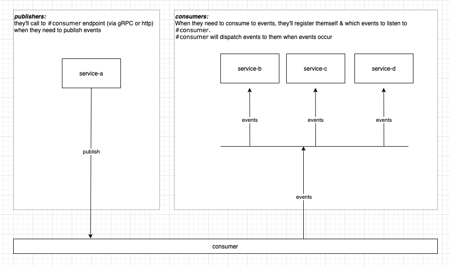

# Consumer

An event dispatcher that helps deliver event messages to target services.

## Architecture



## Publish events

To reduce dependencies on each service, `#consumer` provides an endpoint (gRPC & Restful) to help services publish events.

### The gRPC way

Follow the contract at `./evhub/proto/consumer.proto` to build client that calls `Consumer.PublishEvent` endpoint.
This is an effective and recommended way.

The gRPC should be available at `http://consumer:55051`.

### The Restful way

This is an easy way, but it'll spend more resource, as you already know the way of Restful works, compares to gRPC.
For the endpoint and payload, you could prefer swagger

## Consume events

This is consumer primary responsibility. It helps to deliver events what were published from above step to target services
what are interested in.

To listen a `topic` (you also call `event`), you'll need to register your service interesting with consumer in configuration file
at deployment repository ()

Each service registers itself to consumer has create an item in `services` attributes, below is sample for `echo` service
register to listen to event `user.profile_updated`

```yaml
# config.yml

services:
  - service_id: echo
    # this url will be called when events occur,
    # normally, our services can see each others just via `http://service_name`
    url: http://echo/api/consume
    listeners:
      - topic: user.profile_updated
        queue: echo:user.profile_updated # can be any, but use service:event_name for debugging easily
```
